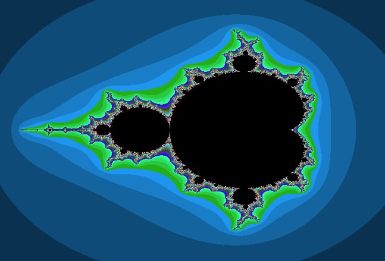

# Mandelbrot Set Visualization | x86-64, C

This project visualizes the Mandelbrot set using a combination of C and x86-64 assembly language. The program is optimized for performance and precision, providing an interactive graphical interface to explore the fractal details of the Mandelbrot set at various scales.

<div align="center">
  
  
</div>


## Features
- **Interactive Exploration**: Zoom and pan through the Mandelbrot set to observe fractal details at different levels of magnification.
- **Performance Optimization**: The program utilizes assembly language (x86-64) to optimize key calculations, ensuring smooth performance even for detailed visualizations.
- **Cross-platform**: Built using the SDL2 library for graphics, making it compatible with multiple platforms.

## Files
- **main.c**: The main C program responsible for initializing the graphical interface and managing the visualization.
- **mandelbrot.h**: Header file containing function declarations and constants for the Mandelbrot set visualization.
- **mandelbrot.s**: x86-64 assembly code that performs the calculations for rendering the Mandelbrot set with optimized performance.
- **Makefile**: Automates the build process, compiling the C and assembly code and linking the program with the SDL2 library.

## Installation

Ensure you have the required libraries installed, especially SDL2, for graphical rendering.

1. **Clone the repository**:
    ```bash
    git clone https://github.com/your-username/mandelbrot-visualization.git
    cd mandelbrot-visualization
    ```

2. **Install dependencies** (if not already installed):
    - **SDL2**: Follow the installation instructions for your platform. For example, on Ubuntu:
      ```bash
      sudo apt-get install libsdl2-dev
      ```

3. **Build the program**:
    ```bash
    make
    ```

4. **Run the program**:
    ```bash
    ./mandelbrot
    ```

## Usage

Once the program is running, you can interact with the visualization:
- **Zoom**: Use the mouse wheel to zoom in and out of the Mandelbrot set.
- **Pan**: Click and drag to move the view around and explore different areas of the set.

## Clean Up

To clean the build files, run:
```bash
make clean

## License

MIT License
